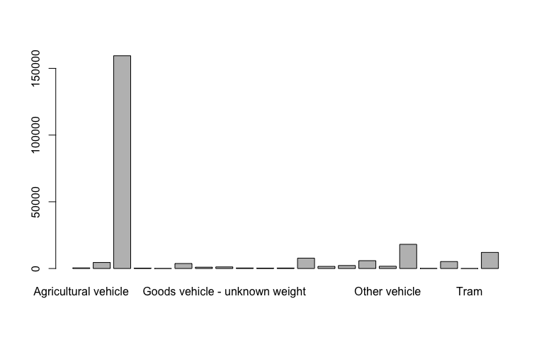
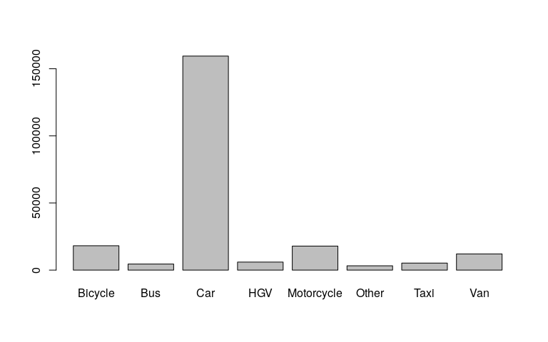

<!-- README.md is generated from README.Rmd. Please edit that file -->

<!-- [](https://travis-ci.org/ITSLeeds/traffiCalmr) -->

<!-- [](https://codecov.io/github/ITSLeeds/traffiCalmr?branch=master) -->

<!-- [](https://ci.appveyor.com/project/layik/traffiCalmr-05ana) -->

[](https://www.repostatus.org/#active)

# traffiCalmr

This is an R package to support road safety and traffic calming
measures.

# Installation

``` r
remotes::install_github("saferactive/traffiCalmr")
```

``` r
library(traffiCalmr)
```

# Get traffic calming data

``` r
traffic_calming_points = tc_get_osm(bbox = "chapeltown leeds")
```

``` r
mapview::mapview(traffic_calming_points["traffic_calming"])
```


# Recoding data

Recode vehicle types:

``` r
tc_recode_vehicle_type(c("Bus long", "Motorcycle long name"))
#> [1] "Bus"        "Motorcycle"
```

This can be useful in visualisation:

``` r
v = stats19::get_stats19(year = 2018, type = "vehicles")
#> Files identified: dftRoadSafetyData_Vehicles_2018.csv
#>    http://data.dft.gov.uk.s3.amazonaws.com/road-accidents-safety-data/dftRoadSafetyData_Vehicles_2018.csv
#> Data already exists in data_dir, not downloading
#> Data saved at ~/stats19-data/dftRoadSafetyData_Vehicles_2018.csv
v$vehicle_type_simple = tc_recode_vehicle_type(v$vehicle_type)
barplot(table(v$vehicle_type))
barplot(table(v$vehicle_type_simple))
```



Note that the second plot on the right is much easier to interpret. See
[`?tc_recode()`](https://saferactive.github.io/traffiCalmr/reference/tc_recode.html)
for details.
