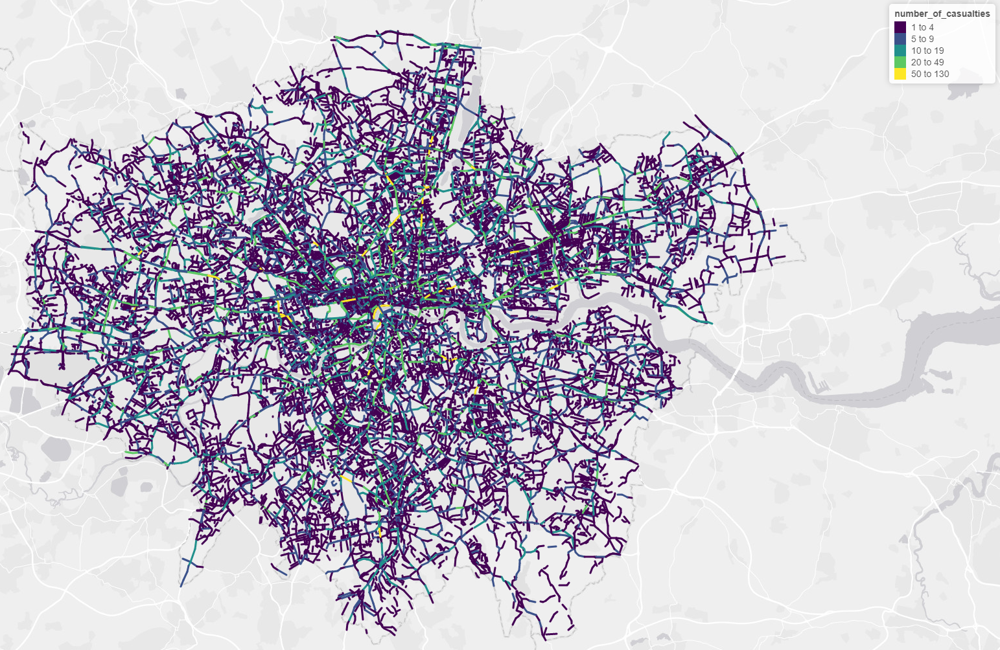

```{r, include = FALSE}
knitr::opts_chunk$set(
  collapse = TRUE,
  comment = "#>",
  echo = FALSE
)
```

```{r setup}
library(trafficalmr)
```

# Introduction

This report outlines progress on the SaferActive project since the 1st report's publication in July 2020.
Overall we have been working on the following areas:

- Development of the trafficalmr R package, adding functionality for cleaning and visualising road crash data (see [saferactive.github.io/trafficalmr](https://saferactive.github.io/trafficalmr) for details)
- Collecting and analysing data on cycling levels from the DfT's traffic count data, recently updated to include 2019 data and undertaking spatio-temporal analysis of cycling resulting from these estimates, building on our work in Report 1 (Section [8](https://saferactive.github.io/trafficalmr/articles/report1.html#analysis)), which provided geographic estimates of cycling uptake.
- Developing new methods for the geographic analysis and visualisation of road safety outcomes
- Exploring additional datasets to use as 'explanatory variables' to assess the impacts of different interventions

# Software development

One of the objectives of the project was to develop software to enable access to data on traffic calming interventions.
We have progressed with the development of the `trafficalmr` package for reproducible road safety analysis, supporting the project and other projects on road safety.
We would like feedback from stakeholders: is it easy to use? what additional functionality would you like to see? The list of functions provided by the package can be found here: https://saferactive.github.io/trafficalmr/reference/index.html

# Analysis of cycle counter data

We analysed the DfT's manual traffic count data to explore its potential to provide estimates of the spatio-teamporal estimates of cycling levels --- measured in km (or billion km, bkm, for compatibility with international road safety research) cycled per year --- over time.
A key component of this work was the expansion of the geographical scope from our London case study, to cover the whole of England, Wales and Scotland.

Over the period 2000-2019, there is an uneven number of locations where annual average daily flow (AADF) estimates are available, as shown in Figure \@ref(fig:aadf-counts-per-year).


```{r aadf-counts-per-year, fig.cap="AADF counts per year in the DfT's traffic counter dataset (left), and the number of annual surveys per count location (right)", out.width="49%", fig.show='hold'}
knitr::include_graphics(c(
  "https://raw.githubusercontent.com/saferactive/saferactive/master/figures/aadf-counts-per-year.png",
  "https://raw.githubusercontent.com/saferactive/saferactive/master/figures/aadf-counts-per-year-2-plus.png"
  ))
```

Figure \@ref(fig:aadf-counts-per-year) reveals a high degree of mobility of cycle count points over the last two decades. 
There are >2000 locations that have been sampled just once over the years 2000-2019, and >4000 locations that have been sampled in just two of these years.
Relatively few locations have been sampled in more than 11 years. 
This flux in the location of count points makes it more difficult to assess changes in cycling uptake, because we do not have a consistent dataset from one year to the next.
In addition, the number of count points has fluctuated from year to year, with over 14,000 count points in 2008, but less than 7000 counts in 2014. 
However, sampling location selection has been more consistent over the period 2010-2019. 

Over the years 2010 to 2019, there are 3,049 count locations which had continuous readings for each of these 10 years. 
This represents 35% of the total counts in these years.
Taking solely these 3,049 count locations, we are able to generate estimates of cycling uptake at the local authority level which are fully independent of year-to-year changes in the location and type of roads chosen for cycle counts.
These uptake estimates are presented, relative to 2011 cycling levels, in Figure \@ref(fig:aadf-uptake-2011-multiplier-line-mean), showing an upward trend in cycling uptake in the first half of the decade. 

```{r aadf-uptake-2011-multiplier-line-mean, fig.cap="Cycling uptake estimates for all local authorities in Great Britain. Black line width represents the number of counters in each local authority, the white line represents no cycling uptake, and the red line is the weighted mean for all cycle counters from 2010 to 2019.", out.width="100%"}
knitr::include_graphics("https://raw.githubusercontent.com/saferactive/saferactive/master/figures/aadf-uptake-2011-multiplier-line-mean.png")
```

The mean AADF per year, for the years 2010-2019, is shown in Figure \@ref(fig:aadf-years).
We include three different estimates of mean AADF: across all 13,303 locations with at least two years of data, across the 5,895 locations with at least 5 years of sampling, and across the 3,049 count locations with complete annual data.

```{r aadf-years, fig.cap="Mean annual average daily flows of pedal cycles 2010-2019, for count locations with at least 1 year, 5 years, and 10 years of counts across this time period"}
knitr::include_graphics("https://raw.githubusercontent.com/saferactive/saferactive/master/figures/AADF-by-n-years-sample.png")
```

We can see that not only is the temporal trend different if we include a greater number of cycle count points, but the mean AADF is also higher.
One reason for this is that counts are made on roads of a wide range of types.
Of the count points with continuous readings in the years 2010-2019, 75% are on 'C' and unclassified roads, 24% on 'B' roads, and less than 1% on principal or trunk 'A' roads. 
By comparison, of all count points during these years, 47% of counts are on 'C' and unclassified roads, 14% on 'B' roads, 31% on principal 'A' roads and 8% on trunk 'A' roads. [switch to all count points with at least 2 years of data]

This is relevant because mean AADF varies greatly by road type. 

For count points with complete annual data, the increase in cycling uptake during the years 2010-2014 closely corresponds with counts from minor roads ('B', 'C' and unclassified roads).
However, mean AADF is highest on Principal 'A' roads at 214 cycles per day, and lowest on Trunk 'A' roads at 2.4 cycles per day. 
On Trunk 'A' roads, zero cyclists were recorded at 34% of counts; many of these may represent locations on major national routes that are unsuitable for most cyclists. 

The number of counts held on roads of different types also varies from year to year, although there is greater consistently in the decade 2010-2019 than in the previous decade.

We further investigate cycle flows on different types of road. 


<!-- Using all cycle count points in London over the years 2010-2019, we produced a GAM model with smooth terms for year, space, road category.... -->

Preliminary results, based on a General Additive Model (GAM) are shown in Figure \@ref(fig:gam1).

```{r gam1, fig.cap="Preliminary estimates of cycling uptake in London boroughs relative to 2011 levels, 2000-2018. A selection of boroughs of interest are highlighted for reference.", echo=FALSE}
knitr::include_graphics("https://raw.githubusercontent.com/saferactive/saferactive/master/figures/cycle-uptake-la-london-smoothed.png")
```

Building on results for London, we scaled-up the approach to provide nationwide spatio-temporal estimates of cycling. 

The national GAM model has smooth terms for the variables year, space and road category, each of which were found to be significant at p<0.05. 
This model uses all counts during the years 2010-2019, not just the counts from locations that were sampled every year. 
This allows us to make full use of the available data.

The smooth term for year uses a cubic regression spline with 5 knots. 
The cubic spline utilises a low number of knots spread at even intervals through the range of parameter values. 
This helps to prevent overfitting.

British National Grid eastings and northings are represented in a duchon spline, which allows for two dimensional smoothing. 
This spline has 100 knots, enabling the representation of complex spatial patterns in cycling levels across the UK. 

Road category is included as a random effect in the model. 
Its inclusion is vital given that cycling levels vary greatly according to the type of road surveyed, and the number of counts from roads of each category varies from year to year. 

The partial effects of year are shown in Figure \@ref(fig:gam-year).

```{r gam-year, fig.cap = "Partial effects of year in a national GAM model for cycle counts 2010-2019"}
knitr::include_graphics("https://raw.githubusercontent.com/saferactive/saferactive/master/figures/GAM-partial-effect-of-year.png")
```

The partial effects of space are shown in Figure \@ref(fig:gam-space).

```{r gam-space, fig.cap = "Partial effects of year in a national GAM model for cycle counts 2010-2019"}
knitr::include_graphics("https://raw.githubusercontent.com/saferactive/saferactive/master/figures/GAM-partial-effect-of-space.png")
```

The results of this GAM model can be applied to Local Authorities....

# Geographic data analysis

Building on methods we initially developed for the [CyIPT](https://www.cyipt.bike/) project, we have developed new techniques for allocating crashes to features on the road network, such as junctions and road sections.
Preliminary results comparing CyIPT results and results from this project are shown in Figure \@ref(fig:cyipt-crash).

```{r cyipt-crash, fig.cap="CyIPT methods for allocating crashes to juctions (left) compared with preliminary results of updated methods developed for the SaferActive project (right).", out.width="40%", fig.show='hold', echo=FALSE}
knitr::include_graphics(c(
  "https://raw.githubusercontent.com/saferactive/saferactive/master/figures/cyipt-crashes1-2.png",
  "https://raw.githubusercontent.com/saferactive/saferactive/master/figures/cyipt-crashes2.png"
))
```


The objective of this part of the project is to increase to measure to level of risk of collisions at a very high level of spatial detail. Ideally we seek to use historical data to identify specific roads and junctions which are especially dangerous and thus need to be fixed.

The first stage of the process is to separate crashes which occurred at junctions, and those that did not.  Junctions are a known “hotspot” for collisions thus should be treated separately from roads in general.  Fortunately the stats19 data indicated whether a collision occurred at or near a junction.
The second stage of the process it to simplify the road and junction network for analysis.  This is a complex multistage process, but the overall objective is to reduce the road network so simple an easily comprehensible from by excluding and aggregating unnecessary details. For example, a single road will be represented within the OpenStreetMap as many geometries. For our purposes, a single line representing the main centreline of the road is sufficient. Thus small details just a turning lanes, or alleyways are removed and road segments are combined into a single linestring.  Road segments are grouped by road name and reference allowing for “human legible” road units to be constructed. In the case of very long roads (over 1km) roads are broken into 500m sections.

Junctions are similarly simplified.  Firstly, all junction points are extracted from the OSM. Junction points are then clustered together to reflect how we naturally think about junctions.  For example, a roundabout is a single large junction not 4 - 10 small junctions arranged in a circle. Here a balance has to be struck between making the clusters large enough that big complex junctions are grouped together, while not being so large that densely packed urban streets become a single super-junction. We found a 15 metre buffer to be the optimal size for coalescing junction clusters.

The third stage is to associate the point crash data with the appropriate road or junction. Here we had to balance accuracy against performance.  Measuring the distance between every crash and every road would take an inordinate about of time.  Thus we must use cleaver shortcuts to reduce to computational load without risking incorrectly matching crashed and roads.

Once matching is completed is it possible to map the number of crashes or casualties for each road and junction over the last 10 years.

```{r cyipt-crash2, fig.cap="Preliminary maps of London roads showing number of casualties over the last 10 years from crashed not at junctions", out.width="40%", fig.show='hold', echo=FALSE}

```


# Analysis of data on traffic calming

[Which types of traffic calming measure to investigate]

[The CID]

[Measures to represent filtered permeability and Low Traffic Neighbourhoods]


# Scenario development


# Next steps

Use our annual Local Authority level estimates of exposure and of collision rates to assess temporal and spatial changes in risk. 
This is primarily analysed as KSI/bkm.

Investigate the impact of traffic calming measures.

Launch our scalable web application.

[Look ]

