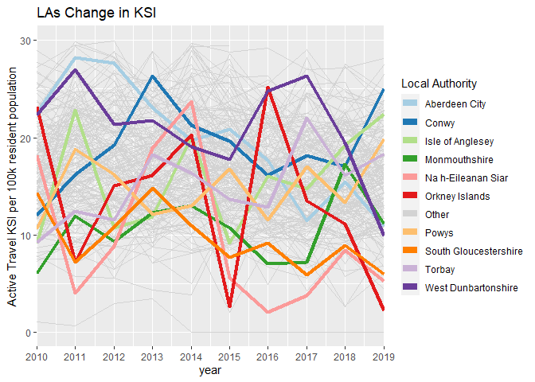
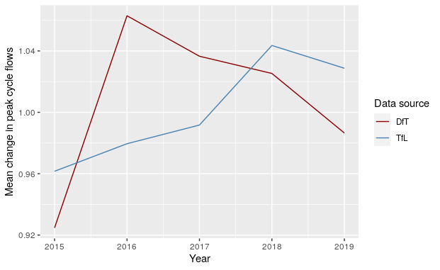

```{r, include = FALSE}
knitr::opts_chunk$set(
  collapse = TRUE,
  comment = "#>",
  echo = FALSE
)
```

```{r setup}
library(trafficalmr)
```

# Introduction

<!-- Add context, how the work done in this quarter relates to previous work, the long term aims of the project -  see https://github.com/saferactive/saferactive/issues/59 -->

<!-- What kind of interventions are available? -->

<!-- Reference under-review. -->

<!-- Where do collisions happen? -->

This document reports on work done during the third quarter of the SaferActive project.
To put this work in context, the report comes around half way in the overall project timeline, which can be defined in terms of the following quarterly milestones:

1. [Report 1](https://saferactive.github.io/trafficalmr/articles/report1.html): on input data
2. [Report 2](https://saferactive.github.io/trafficalmr/articles/report2.html): scenarios
3. [Report 3](https://saferactive.github.io/trafficalmr/articles/report3.html) (this report): modelling uptake and safety levels of active travel over time
4. Final project report and end-of-project workshop
5. Refined project web app pending feedback from workshop and stakeholders

We have adapted the project since its initial inception in the pre-pandemic world, to broaden the definition of 'traffic calming measures' to include 'Low Traffic Neighbourhood' (LTN) interventions.
This, and unexpected issues around the analysis of cycle counter datasets from DfT and TfL has led to more time spent on the analysis phase and less work on the web app.
In terms of timelines, the project has been extended by 4 months, meaning that milestones 4 and 5 above will be delivered by the end of July and October 2021.

It is now almost a year since the coronavirus pandemic caused major changes to social, economic and transport systems.
Although the future course of the pandemic (despite the planned roll-out of vaccination programs during 2021), let alone long-term impacts, are still uncertain, there are several clear trends that have consequences for road safety in relation to walking and cycling that look highly likely to continue for the next 12 months at least:

- More working from home: [31](https://www.ons.gov.uk/peoplepopulationandcommunity/healthandsocialcare/conditionsanddiseases/bulletins/coronavirustheukeconomyandsocietyfasterindicators/10december2020)% of people reported working exclusively from home in December 2020, a figure that has increased slightly since summer (Figure \@ref(fig:wfh)). There are several reasons why this trend will stick [@barrero_why_2020].
- Reduction in peak hour traffic, as shown in reduced travel on working days, the troughs in Figure \@ref(fig:peak). This increases the potential for road space reallocation for safe walking and cycling.
- People are walking and cycling more. Data on walking uptake are not reported by in the DfT's COVID-19 transport statistics but the trend from Figure \@ref(fig:covid) suggests the mode shift to cycling persists, even during winter months.

```{r wfh, fig.cap="Proportion of adults, Great Britain, 14 May to 6 December 2020, who worked from home exclusively has hovered around 30%, a huge increase compared with the 5% who worked from home in [2019](https://www.ons.gov.uk/employmentandlabourmarket/peopleinwork/employmentandemployeetypes/articles/coronavirusandhomeworkingintheuklabourmarket/2019). Source: [ONS](https://www.ons.gov.uk/peoplepopulationandcommunity/healthandsocialcare/conditionsanddiseases/bulletins/coronavirustheukeconomyandsocietyfasterindicators/10december2020)."}
knitr::include_graphics("wfh-trends-2020-12.png")
```


```{r peak, fig.cap="Top: Traffic has been substantially down compared with pre-pandemic levels, especially during the rush hour peak. Source: [ONS](https://www.ons.gov.uk/peoplepopulationandcommunity/healthandsocialcare/conditionsanddiseases/bulletins/coronavirustheukeconomyandsocietyfasterindicators/10december2020).. Bottom: traffic levels in the Leeds-Bradford area by day of week over time in 2020. Source: [TomTom](https://www.tomtom.com/en_gb/traffic-index/leeds-bradford-traffic/).", fig.show='hold'}
knitr::include_graphics("traffic-trends-2020-12.png")
knitr::include_graphics("traffic-trends-tomtom-2020-12.png")
```

```{r covid, fig.cap="Travel by different modes of transport relative to pre-pandemic (early March) levels. Dark lines represent 30 day rolling averages. Source: [DfT](https://www.gov.uk/government/statistics/transport-use-during-the-coronavirus-covid-19-pandemic)", warning=FALSE, out.width="100%", message=FALSE}
# Aim: get daily summary tables from UK's DfT

library(dplyr)
library(ggplot2)

u = "https://assets.publishing.service.gov.uk/government/uploads/system/uploads/attachment_data/file/942559/COVID-19-transport-use-statistics.ods"
f = basename(u)
download.file(u, f)
d_original = tibble::tibble(readODS::read_ods(f, skip = 6))
names(d_original) = gsub(pattern = "\\d", replacement = "", x = names(d_original))
d = janitor::clean_names(d_original)
d = d[nchar(d[[1]]) == 10, ]
d$date = lubridate::dmy(d$date_weekends_and_bank_holidays_in_grey)
d = d %>% select(-(cars:heavy_goods_vehicles))

d = d %>%
  mutate(across(all_motor_vehicles:cycling, as.numeric))
  # mutate(across(cars:cycling, as.numeric))
# summary(d)

droll = d %>%
  mutate(across(all_motor_vehicles:cycling, zoo::rollmean, k = 30, align = "right", fill = NA))
  # mutate(across(cars:cycling, zoo::rollmean, k = 30, align = "right", fill = NA))
# d
# nrow(d)
d_long = tidyr::pivot_longer(d, cols = all_motor_vehicles:cycling)
droll_long = tidyr::pivot_longer(droll, cols = all_motor_vehicles:cycling)
d_long$date = as.Date(d_long$date)
droll_long$date = as.Date(droll_long$date)
g = ggplot(droll_long) +
  geom_line(aes(date, value, colour = name), size = 1.3) +
  geom_line(aes(date, value, colour = name), alpha = 0.3, data = d_long) +
  scale_y_continuous(labels = scales::percent) +
  theme_bw()
gp = plotly::ggplotly(g)
w = plotly::as_widget(gp)
w
removed = file.remove("COVID-19-transport-use-statistics.ods")
```

In the policy realm, the £250m Active Travel Fund has now been fully allocated and is being spent in local authorities nationwide, with particular emphasis on LTNs and new walking and cycling improvements.
Academic research on historic LTNs suggest that they can lead to substantial increases of walking and cycling, with reported walking and cycling levels increasing by 29% and 51% in Waltham Forest between 2016 and 2019 and reduced overall risk levels for these modes reducing by three-to-four fold [@goodman_impact_Underreview].
Such increases in road safety for active modes could, if they are repeated across multiple local authorities nationwide, herald the start of a step change in road safety for walking and cycling.

This report sets out to explore the evidence for changes at the city level across London and nationwide.

# Is active travel getting safer?

The aim of this section is to provide estimates of casualty risk for walking and cycling at high geographic resolution and over time.
This is not an easy task: evidence on cycling and particularly walking levels is patchy, while crash datasets are intermittent and sporadic.
This section outlines the approach we took to help answer the question, which consists of the following main stages, each of which support the aim of quantifying risk over space and time in established measures, primarily the number of people killed and seriously injured per billion km (KSI/bkm):
<!-- and equivalent metrics for all injuries (I/bkm) and fatalities (K/bkm): -->

- Calculate the change in different types of crashes at high geographic resolution over time (and analysis of the shifting trends in crash data), the 'numerator' in risk calculations
- Calculate the exposure in terms of distance walked/cycled
- Calculate change in safety levels over time

<!-- High level aim. -->

## Assigning collision data to a spatial grid {#collision}

Grouping crashes together at a small spatial scale help to identify crash hot spots, areas where crashes happen unusually often. To this end crash data for the last 10 years was rasterised to a 500m grid. In each raster a single pixel covers a 500m x 500m area and contains a single value, for example, the number of people killed in that area in 2018. It is also possible to create a stack of multiple raster layers to represent a chaining variable, such as time.

We created twelve raster stacks with each stack covering the years ten years of available data 2010 to 2019. Each raster stack was created for the whole of Great Britain (results shown below for London for all modes).

* Cyclists killed or seriously injured during commuting hours
* Cyclists killed or seriously injured during any time of day
* Cyclists with any injury during commuting hours
* Cyclists with any injury during during any time of day

* Pedestrians killed or seriously injured during commuting hours
* Pedestrians killed or seriously injured during any time of day
* Pedestrians with any injury during commuting hours
* Pedestrians with any injury during during any time of day

* All people killed or seriously injured during commuting hours
* All people killed or seriously injured during any time of day
* All people with any injury during commuting hours
* All people with any injury during during any time of day

Commuting hours were defined as being between 7 - 10 AM and 4 - 7 PM, and where selected for special study as the PCT estimates of cycling levels are based on travel to work data.

```{r raster, fig.cap="Example of the rastered crash data from 2019 for London, showing areas with more casualties in darker red"}
knitr::include_graphics("https://user-images.githubusercontent.com/15819577/96473494-9fddbb80-1229-11eb-9efb-aef24154e7db.png")
```

## Measures of active travel safety at the local authority level

We have adjusted the plots to show KSI rate of active travellers per 100,000 people in the resident (left map) and working (right map) populations. The KSI rate varies significantly with 90% of LAs having rates between 8.2 and 24.1 per 100,000 residents. Scotland has notably low KSI rates, while Cumbria and Lancashire have high rates.

```{r LAtrends2, fig.cap="Number of active travel (walking and cycling) casualties killed and seriously injured (KSI) per 100,000 resident population (left) and working population (right), 2010-2019."}
 knitr::include_graphics("crash_la_plot-1.png")
```

Based on these population-based measures, the City of London is an outlier due to its very low resident population, highlighting the importance of denominator selection in road safety research.
In the case of the City of London, the resident population of about 2,500 is not representative of the amount of active travel. 
It is notable that Cumbria is a popular tourist destination and may have more active travel than is represented by its population. 
The same may be true of other popular tourist areas and seaside towns, such as North Wales, the south coast and the Scottish Highlands.

The right plot uses the 2011 census workplace population for England and Wales. The workplace population favours areas like the City of London which have high daytime activity but few night time residents. As people working is a subset of all people KSI rates will naturally appear higher. However the relative distribution of risk does change under a workplace population approach suggesting that in at least some areas this is an appropriate way to consider the data, in the absence of robust estimates of travel presented in subsequent sections.

We can also compare the proportion of slightly injured people vs the proportion of KSI casualties. Weighting factors account for the adjusted proportion of serious causalities caused by the historic use of different reporting systems. However this difference may still be due to different reporting practices across the country.

If the 'proportion of KSI' represents a genuine difference in safety, then LAs with a high ratio (dark green in Figure \@ref(fig:slight-ksi)) are having proportionally more slight casualties than serious and fatal ones. This could be due to more segregation of active travellers from motor traffic, lower traffic speed or greater driver awareness of active travellers.

```{r slight-ksi, fig.cap="The proportion of casualties that are 'slight' at the LA level nationwide based on 2010-2019 STATS19 data."}
knitr::include_graphics("https://raw.githubusercontent.com/saferactive/saferactive/master/LA_trends_files/figure-gfm/crash_la_plot2-1.png")
```

Looking at absolute number of KSI, the top 10 and bottom 10 are the same in 2010 and 2019 suggesting no overall change. The plot below shows the Active Travel KSI rate per 100,000 workplace population from 2010 to 2019. The majority of LAs are shown with the thin grey lines, while the top 5 and bottom 5 LAs are highlighted in colour. Three of the top five are London Boroughs, with the others being the seaside towns of Portsmouth and Blackpool.

```{r LAtrends3, fig.cap="Top and bottom LAs for KSI per 100,000)"}
 knitr::include_graphics("trends_plot-1.png")
```

If we look for areas with the biggest change in KSI rates between 2010 and 2019 we can see some weak noisy trends, with areas such a Torbay increasing in KSIs and Stoke on Trent declining.

If we instead compare KSI against the resident population (adding in Scotland to the analysis) we can see that Aberdeen City have made a sustained decline in KSI rates over the last ten years, down over 60% from their high in 2011. Unlike some other LAs where the rate appears variable but steady, the KSI rate in Aberdeen has fallen almost every year and thus may represent a real world change in safety worthy of detailed study. In particular the Launch of Scotland’s Road Safety Framework in 2009 may have been successful in reducing Active Travel KSIs.

```{r LAtrends4, fig.cap="Las with the greatest change in KSI per 100,000 between 2010 and 2019"}
 
```

## Assigning census-derived cycling data to a spatial grid

To estimate the spatial distribution of cycling activity, measured in km per year, we started with data from the Propensity to Cycle Tool (PCT).
The Route Network layer in the PCT provides an indication of the number of commuter cyclists on different parts of the network, based on 2011 Census data reporting the number of people travelling between small (LSOA, average population \~2000) zones by mode of travel.
The route network in the PCT represents the 'fastest' routes for cycling between these LSOA zones and is not therefore designed to represent where cycling takes place (there are may be some links on the route network where the people prefer a slower but safer route).

Converting the spatial network representation of cycling to a spatial grid has the advantage of 'smoothing' out cycling activity across cities and allowing cycling levels to be presented in a form that is directly comparable with the crash data, which as also assigned to the spatial grid, as described in Section \@ref(collision).
The three main steps were:

-   Break-up long route network segments so that only segments with a length of 200 m or less remained.
To do this we initially solved the problem in R, developing the function [`line_breakup()`](https://docs.ropensci.org/stplanr/reference/line_breakup.html) in the `stplanr` package for the purpose.
After realising that this implementation would take several hours to complete on the national route network, we opted for a more computationally efficient approach that used R's interface to GIS algorithms in the `qgisprocess` package.
-   Calculate the distance cycled, in km per year, on each of the shortened segments on the updated route networks as follows: $$
    d_y = t_s * t_y * d_s
    $$ where $d_y$ is distance cycled per year per segment, $t_s$ is the number of trips per segment, $t_y$ is the number of trips in either direction made, on average, per year and $d_s$ is the distance of each segment.
    $t_s$ and $d_s$ are taken directly from the PCT and $t_y$ was set to 253 commute trips per day multiplied by two, based on guidance from @departmentfortransport_active_2020 and based on the fact that the PCT counts only record cycling flows in one direction.
    [Summing](https://github.com/saferactive/saferactive/blob/master/code/rasters-rnet.R#L56) these values for all route network segments across England and Wales yielded a total of 1.1 billion km cycled in 2011, roughly a quarter of the 4.5 billion km cycled by any mode in England and Wales according to the National Travel Survey (see table NTS0303 and analysis in the script [`nts-national-distance-cycled-year.R`](https://github.com/saferactive/saferactive/blob/master/code/nts-national-distance-cycled-year.R) for details).
-   Add the total distance cycled of each segment per grid cell, based on the centre point (centroid) of each segment of 200 m or less.

The results are shown in Figure \@ref(fig:cycled-yr).

```{r cycled-yr, fig.cap="Estimates of distance cycled per year (thousand km per year of cycle commuting distance) passing through each 500 m grid cell, based on analysis of Census data on the route network from the PCT, for a rural area (Herefordshire, left) and an urban area (London, right).", out.width="40%", fig.show='hold'}
# see https://github.com/saferactive/saferactive/issues/48
knitr::include_graphics(c(
  "https://camo.githubusercontent.com/4404fcf913b19c521aa249cd14e8b047c8a2a646/68747470733a2f2f692e696d6775722e636f6d2f57596b6c59476a2e706e67",
  "https://user-images.githubusercontent.com/1825120/97345445-fed2ae80-1881-11eb-8b1e-18553c1805c1.png"
))
```

## Spatial analysis of risk levels

In the first SaferActive report ([Section 8](https://saferactive.github.io/trafficalmr/articles/report1.html#analysis)) we reported estimated KSI/bkm at the local authority level across London, highlighting the fact that although more crashes happen in the city centre, the risk *per km cycled* is higher in the outskirts of the city.

The additional datasets generated using methods outlined in the previous sections allow us to generate these estimates at higher levels of geographic resolution, as illustrated in Figure \@ref(fig:ksi-raster).

```{r ksi-raster, out.width="48%", fig.show='hold', fig.cap="Estimates of the geographic distribution of commuter cycling risk measured in KSI/bkm at 500 m and 4 km grid cell resolutions (top) and all commuter cycling injuries at 500 m and 2 km resolution (bottom), 2010-2019."}
knitr::include_graphics(c(
  "https://user-images.githubusercontent.com/1825120/102293622-6088ce00-3f3f-11eb-80c4-8eda9fe0fd4e.png",
  "https://user-images.githubusercontent.com/1825120/102293822-c37a6500-3f3f-11eb-993d-b26271cfa8ef.png",
  "https://user-images.githubusercontent.com/1825120/102291180-76e05b00-3f3a-11eb-971e-e1ec7e3bef3b.png",
  "https://user-images.githubusercontent.com/1825120/102291276-b0b16180-3f3a-11eb-844b-a9690b1bfa74.png"
  ))
```


It is clear from the results that outer London is a more dangerous place to cycle than inner London. 
However, places where cycling levels are low will tend to have more variable collision rates with less certainty, which means that an apparent high rate in a given year could actually be an artefact of the high variability in collision rates per km cycled.
There are at least three ways of dealing with this issue:

- Only focus on areas with a sufficiently high level of exposure (cycling km in this case), with some cut-off (e.g. 1000 km per 500m grid cell per year minimum).
- Geographic aggregation, as shown in the figures above.
- Visualisation or other techniques to communicate uncertainty, e.g. by making estimates based on lower levels of exposure more transparent.

A second potential source of error is that, even in peak hours, many cycle journeys will be for non-commute purposes. 
The proportion of journeys that are for the purpose of travel to work will vary from one area to another.
Since we are only counting journeys to work, our estimated collision rates per km cycled will be relatively higher than they should be in areas where less cycle journeys are for commuting purposes.

## Modelling spatio-temporal change in cycling uptake based on count data

As described in [Section 2.3](#assigning-collision-data-to-a-spatial-grid), our primary data source for estimating levels of cycling activity across space is the Propensity to Cycle Tool. 
This takes 2011 Census data on method of travel to work, and routes these journeys using a CycleStreets routing algorithm, allowing us to estimate cycle potential on each link of the road network. 
However, this does not give us any information on changes in cycling uptake through time. 
To estimate changes through time, we must investigate data from manual cycle counters.

We have used two key data sources to model this spatio-temporal change in cycling uptake.
The first is DfT count data.
This is open source data available from the Department for Transport website https://roadtraffic.dft.gov.uk/downloads.
While the raw data is available for the years 2000 - 2019, we have focused on the decade 2010-2019, since there is more consistency in the type of roads being surveyed over this time period.

The second data source is Transport for London cycle counts, collected as part of three data collection programmes, for Central London, Inner London and Outer London https://cycling.data.tfl.gov.uk/. 
There are other TfL count programmes focusing on specific interventions such as the cycle superhighways and Mini-Holland schemes, but we have not used these to keep our results representative of London as a whole. 
The Central London counts are available from 2014, but the other counts are only available from 2015 to 2019, so we have used this time period.

To make the best possible use of the available data, we have developed two models.
For change in cycling uptake over the years 2010-2015, we have a model based solely on the DfT counts, as these are the only ones available during this time period.
For the years 2015-2019, our model combines both the DfT and TfL counts.
To assess change across the full decade, we combine these two models, computing changes since 2015 on top of the changes seen up to this point.

Rather than using the raw cycle counts, i.e. number of cyclists passing a given point per hour, we assess relative change in these cycle counts. The number of cyclists varies greatly from one road to another, and the same count points are not always used each year. Therefore the variable of interest is the change in cycle volumes at a given count point: $$
Ch_y = C_y / C_m
$$ where $Ch_y$ is the change in cycle count for a given year, $C_y$ is the cycle count for the year of interest, and $C_m$ is the mean cycle count at that count point across all years within the model period that the count point is in use. 

To avoid the impacts of high relative change in cycle flows at count points with very low absolute numbers of cyclists, we excluded all data from locations with a mean cycle flow < 5, or with zero cyclists in any single year.
We also excluded locations that did not have at least two years of data within the relevant period.

### Data cleaning steps

Since our primary spatial model of cycling potential is derived from Census 2011 data accessed via the Propensity to Cycle Tool, we had to adapt the count data accordingly. 
As part of the data cleaning process, we made efforts to correspond closely with Propensity to Cycle Tool methodologies. 
All of these adjustments were made on the raw count data, prior to calculating change in cycle volumes.
Firstly, we combined bi-directional data to get a single measure of cycle volume per site, similar to the PCT which combines journeys in both directions between a common origin and destination. 
Secondly, we used peak hour flows only. 
Our spatial model is based solely on travel to work, so temporal changes to this model should reflect changes in commuter volumes, not changes in whole-day cycle volumes. 
The TfL counts run from 06:00 to 22:00, while the DfT counts run from 07:00 to 19:00, but we selected only the counts from peak commuter hours, defined by TfL as being 07:00 - 10:00 and 16:00 - 19:00.

Further data cleaning was conducted for the seasonal adjustment of cycle flows and the generation of single annual estimates for each count point.
In the TfL Central London dataset, four Survey waves are conducted per year, corresponding with the standard quarterly periods.
The final wave for which data is available is 2019 Q3.
By contrast, in the TfL Inner and Outer London counts and the DfT counts, each location is surveyed at most once per year. 

Cycling uptake varies across the year due to factors such as weather conditions.
TfL has produced seasonal adjustment factors for each of the four quarterly periods, to account for this.
We have used these adjustment factors to control for seasonality, and to calculate a mean annual count for each Central London site.
We desired a single annual figure to avoid giving these central London locations four times the weighting of the other counts when generating the GAM models, as described below.
Meanwhile, the Inner and Outer London TfL counts are designed to represent the second quarterly period (April to June), so we used the Q2 adjustment factor to normalise these counts.
For the DfT counts, we normalised the raw values based on the adjustment factor for whichever quarterly period the count date fell within.

### Trends in mean cycle flows

Mean change in cycle flows over the years 2010-2015 is shown for all DfT count points in London in Figure \@ref(fig:early-year). This shows a steady increase in cycling uptake over the length of the period.

```{r early-year, fig.cap = "Mean change in peak cycle flows for count points in London in the years 2010-2015"}
knitr::include_graphics("peak-flow-trend-early-years.png")
```

In Figure \@ref(fig:late-year), we show mean change in cycle counts over the years 2015-2019, for both DfT and TfL count points. We can see that the trends are quite different in TfL and DfT count points. 
The TfL counts rise throughout this period, while the DfT counts peak in 2016 and fall thereafter.

```{r late-year, fig.cap = "Mean change in peak cycle flows for count points in London in the years 2015-2019"}

```

### Predicting cycle uptake using GAM models

To estimate spatio-temporal changes in cycling uptake over the decade 2010-2019, we have created two GAM models using the `mgcv` R library.
These use the count data to generate smoothed estimates of change in cycling levels in London across this period.
The models use splines to represent the partial effects of time and space on cycling uptake.
The two models follow the same structure, but the first is for the years 2010-2015, using DfT data only, while the second is for the years 2015-2019 and uses both DfT and TfL data.

The response variable in these models is $Ch_y$ (change in cycle flows).
However, total number of cycles (across all years within the model period) per count point is used as a weighting factor. 
This avoids giving undue influence to locations where the relative change in cycle flows may be high but the absolute number of cycles is low.
It also reduces the influence of count locations that are sampled in some years only, compared to those sampled every year.

The error structure in both models follows a Scaled-t distribution.
This is appropriate for continuous response variables which are heavily tailed.
Temporal change is modelled as a cubic regression spline for the term `year`.
We gave a low number of knots (4 knots for 2010-2015 and 3 knots for 2015-2019) to prevent overfitting.
Cubic regression splines are appropriate for variables with relatively few knots, spread evenly across the extent of the parameter values.
Space (`eastings` and `northings`) is modelled using a Duchon spline, which works well with two-dimensional parameters.
We used 100 knots, to allow more complex spatial patterns to be represented.
An interaction term (using the same spline types and numbers of knots) is used for the interaction between time and space.

The partial effects of `year` in these models are shown in Figure \@ref(fig:gam-year). These closely resemble the trends observed in the raw data, in Figures \@ref(fig:early-year) and \@ref(fig:late-year). 
These graphs show the mean effect of `year`, but this will vary spatially due to the presence of the interaction terms in the GAM models.

```{r gam-year, fig.cap = "Partial effects of year in the GAM models. a) left: for the years 2010-2015; b) right: for the years 2015-2019", out.width="40%", fig.show='hold'}
knitr::include_graphics(c("gam-partial-effect-year-early.png", "gam-partial-effect-year-late.png"))
```

We use the models to predict annual changes in cycling uptake over a 500m grid covering the whole of London.
This creates a smoothed surface that matches the resolution of the spatial grids we have already generated for collision and census-derived cycling data.
We can therefore obtain estimates of change in cycling uptake at the same spatial resolution as the collision data.

By assigning each grid point to a London Borough, we can then investigate changes in cycling uptake at the Borough level. These can be seen in Figure \@ref(fig:borough-preds) (figure shows unweighted values).

```{r borough-preds, fig.cap = "Predicted change in cycling uptake for each London Borough, over the years 2010-2019"}
knitr::include_graphics("peak-boroughs.png")
```

## Validation of cycling uptake model results

We have verified the GAM predictions against the TfL count data, to ensure we are representing the true variability of the data. 
This is conducted using the coefficient of determination (R squared).
The result gives an R squared of 0.194, showing the extent to which the model is able to predict counts across London in the years 2015-2019 (see Figure \@ref(fig:validation)).

```{r validation, fig.cap = "Correlation between mean TfL cycle counts and GAM predictions of change, per year and per London Borough"}
knitr::include_graphics(c("peak-hour-correlation.png"))
```

Further validation work should include sensitivity analysis involving the exclusion of portions of the dataset, and the prediction of these excluded portions. 
We also need to obtain confidence intervals to constrain the cycling uptake predictions.

We can also investigate how correlations change with greater temporal and spatial aggregation of data points. 
This may include aggregation to the Borough level, and the grouping of neighbouring Boroughs. 

<!-- ## Modelling spatio-temporal change in collision risk -->

<!-- Joey ~500 words -->

<!-- Depending on the outcome of the previous analysis. -->

<!-- Which kinds of areas seem to becoming safer for walking and cycling in relation to the modelling? -->

```{r, eval=FALSE}
u = "https://github.com/saferactive/saferactive/releases/download/0.1.2/gam-full-results-peak-grid.Rds"
cycle_count_predictions = readRDS(url(u))
head(cycle_count_predictions$change_cycles)
summary(cycle_count_predictions$change_cycles)
summary(cycle_count_predictions$change_cycles[cycle_count_predictions$year == 2011])

```

# Scenarios of change

<!-- Joey and Robin -->

<!-- Majority of collisions on boundary roads. -->

## Traffic calming measures

There is OSM data for the years 2014 - 2019, providing insight on the date of installation of traffic calming measures.
Using two time points (e.g. 2016 and 2018), we have found ways to investigate differences before and after changes go in.

<!-- ## 20 mph zones -->

## Protected cycleways

Counts from cycle superhighways and quietways are available from TfL, typically including 1 year of baseline count data from before installation, and around 4 years of post-installation count data.
<!-- We can speak to TfL to get better insight on the exact timings of implementation of these schemes. -->
We have found a reliable way to access data on *change* in cycle provision, based on a broad definition of cycle infrastructure from the [ohsome](https://ohsome.org/apps/osm-history-explorer/#/cycleways_w/2020-06-01T00:00:00Z/11/51.55754480495398/-0.09713066502234728) project.

<!-- ## Roadspace reallocation -->

## Low Traffic Neighbourhoods

Counts from Mini-Holland schemes are available from TfL, typically including 1 year of baseline count data from before installation, and around 4 years of post-installation count data.
We can speak to TfL to get better insight on the exact timings of implementation of these schemes.

# Data visualisation

We continue to develop approaches to visually analysing road crash data and have divided our efforts here into two areas: **exploring** and **quantifying** risk.

## Exploring risk

Road crash data are spatially and temporally precise but also attribute-rich. The Stast19 dataset for example has many  variables describing numerous aspects associated with road conditions and vehicle types. Exploratory visual analysis interfaces provide a mechanism for quickly investigating these.

As a quick way of illustrating this, below are bar charts displaying crash frequencies for all (left) and active casualties (right) by road speed classification. Crashes resulting in a KSI (fatal or serious injury) are dark red, those resulting a slight injury light red. It is not surprising that 30mph roads are the modal category of road for all crashes, but especially those involving active travel modes. A more interesting question is around how relative injury severity varies by road type and vehicle mode. To quickly investigate this we generate [mosaic plots](https://en.wikipedia.org/wiki/Mosaic_plot), a sort of visual contingency table where plot width varies according to _absolute number_ of crashes in this case and height according to _relative number_ of crashes resulting in a KSI (e.g. the relative height of the dark red bars). Whilst the pattern implied by this layout again could be anticipated, it does demonstrate the obvious effect of increasing road speed limits on injury severity (quantified as KSI rates), for crashes involving pedestrians and cyclists.

<!-- Link to crashes on hierarchy of vulnerability:  -->
<!-- https://itsleeds.github.io/rrsrr/join.html#joining-vehicle-data -->

<!-- can we make total height of each bar proportional to total n. crashes? -->

```{r crashes-speed, fig.cap="Plots of road crashes by road type, speed limit and injury severity – comparison of all versus active-only crashes. Top row: rural, bottom row: urban. KSI in dark red, slight injuries in light red. Recorded crashes in GB 2017-2019.", out.width="45%", fig.show='hold'}
knitr::include_graphics(c(
  "crashes_speed_all.png", "crashes_speed_active.png"
))
```

Once the code template for these plots is created, it is very easy to substitute in other variables that we think may be discriminating -- lighting and surface condition (wetness). Here again we see the strong effect on relative injury severity. We do not advocate using these plots for decision-making, for example prioritising lighting and surface drainage over other candidate interventions, but instead for their application as a low-cost mechanism for initially proposing factors that might then be incorporated into a more formal data analysis.    

```{r crashes-surface, fig.cap="Plots of road crashes by road condition and injury severity – comparison of all versus active-only crashes. KSI in dark red, slight injuries in light red. Recorded crashes in GB 2017-2019.", out.width="45%", fig.show='hold'}
knitr::include_graphics(c(
  "crashes_all_conditions.png", "crashes_active_conditions.png"
))
```

A benefit of using Mosaic plots for presenting categorical data such as this is that they are data rich. For example, we might extend this analysis to profile crashes by travel mode. In the plots below we focus on London. That cars are the modal vehicle category is to be expected, but it is again useful to emphasise the fact that relative injury severity increases with motorbikes and bikes and also that the vehicle-crash mix varies according to geographic context.

```{r crashes-borough, fig.cap="Plots of road crashes by vehicle type. All recorded crashes in London 2009-2019.", out.width="95%", fig.show='hold'}
knitr::include_graphics(c(
  "spine_aspatial.png"
))
```

```{r crashes-borough-spatial, fig.cap="Plots of road crashes by vehicle type and London borough. The graphics show two different ways of representing the numbers of weekday v. weekend crashes involving each vehicle type. All recorded crashes in London 2009-2019.", out.width="95%", fig.show='hold'}
knitr::include_graphics(c(
  "spines_borough.png"
))
```


## Quantifying risk

Inevitably when analysing road crash data we wish to make inferences about casualty rates through comparison -- over time and by geographic areas. There are difficulties with doing this -- comparing rates across areas (and time) -- that are more idiosyncratic relating to the way in which road crash data are collected and choice of denominator, but also established problems in statistics -- for example, uncertainties due to sampling size and multiple comparison. 

Key to this work is incorporating appropriate denominators for estimating exposure, discussed above. However, we are also implementing visual data analysis approaches to uncertainty representation. For illustrative purposes below are maps of relative risk comparing relative injury severity ratio for crashes in each Police Force area against that which would be expected given the national average. Where a Police Force has an injury severity ratio greater than the national average it is red, less than  the national average blue. The left-most map contains risk ratios derived from crash data between 2017-2019; in the middle we demonstrate how these have shifted year-on-year, with no adjustment made for CRASH and COPA re-coding and in the right-most map we represent model uncertainty by drawing year-on-year lines that result from a bootstrap resample. Whilst representing a full empirical bootstrap distribution may be one means of representing uncertainty, we are currently investigating others, for example [hypothetical outcome plots](https://medium.com/hci-design-at-uw/hypothetical-outcomes-plots-experiencing-the-uncertain-b9ea60d7c740), increasingly used in journalism and public-facing domains.    

```{r rr-force, fig.cap="KSI risk ratios by Police Force area in England and Wales, year-on-year analysis, plus bootstrapped raw KSI rates. 2017-2019 data shown in left plot, 2009-2019 data shown in middle and right plots.", out.width="95%", fig.show='hold'}
knitr::include_graphics(c(
  "rr_cots.png"
))
```


<!-- Roger ~500 words - ideas from paper -->

<!-- # Web development -->

<!-- Layik ~500 words -->

# Next steps

The next steps on the project are to:

- Explore the relationships between interventions and change in risk
- Generate models that allow predicting the safety and active travel implications of change
- Visualise the results in an interactive web application

# References
